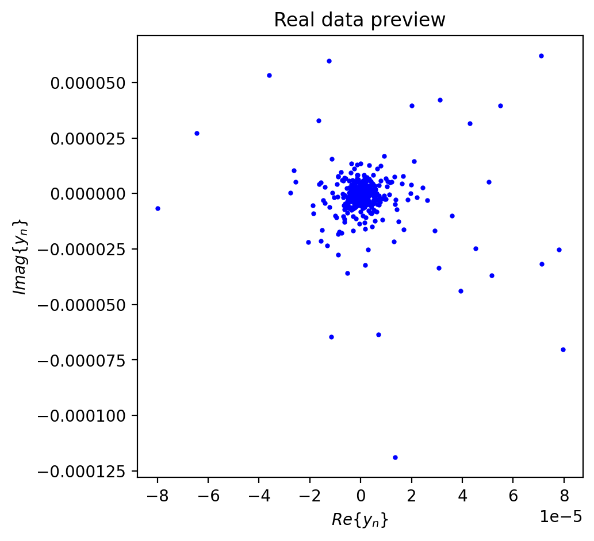
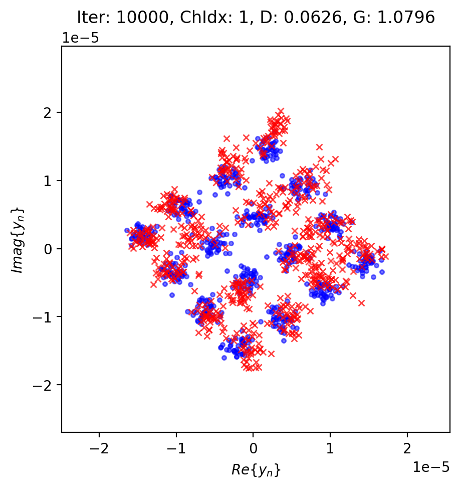

# Exercise 2.4: Channel GAN Implementation

This repository provides the starter code for Exercise 2.4. Your task is to implement the data generation function for a **Conditional Generative Adversarial Network (CGAN)** that simulates a Rayleigh fading channel. The goal is to learn the channel distribution without explicit channel state information (CSI).

## Experiment Setup

The script is set up to train a CGAN using a pre-generated dataset of channel coefficients:

*   **Dataset:** `rayleigh_channel_dataset.mat` (generated via QuaDRiGa)
*   **Model Architecture:** Conditional GAN (Generator + Discriminator)
*   **Input Dimension ($Z$):** 16 (Noise vector)
*   **Constructed Features:** Received Signal $y$, Conditioning Vector (Pilot/Label info)
*   **Training Steps:** 750,000 iterations

## What You Need to Do

| Checklist  | Details                                                                                                                                                                                                                                                                                                                                   |
| :--------- | :---------------------------------------------------------------------------------------------------------------------------------------------------------------------------------------------------------------------------------------------------------------------------------------------------------------------------------------- |
| **Code**   | Open `Exercise_2.4_starter.py` and locate the `generate_real_samples_with_labels_Rayleigh` function. You need to implement:<br> 1. random selection of channel coefficients ($h$);<br> 2. generation of random QAM symbols ($x$);<br> 3. simulation of received signal ($y = hx + n$);<br> 4. construction of the conditioning vector. |
| **Data**   | Ensure `rayleigh_channel_dataset.mat` is present in the directory. You can generate it using the provided MATLAB script `QuaDRiGa_channel_generator.m`.                                                                                                                                                                                   |
| **Run**    | Execute: `python Exercise_2.4_starter.py`                                                                                                                                                                                                                                                                                                 |
| **Observe** | The script saves generated plots in the `ChannelGAN_Rayleigh_images` folder and model checkpoints in `Models/`.                                                                                                                                                                                                                           |

> **Hint:**
>
> *   Use `np.random.choice` to sample from the dataset.
> *   Remember that the received signal $y$ contains both real and imaginary parts.
> *   The conditioning vector typically concatenates the transmitted symbol information (real/imag) and the channel information (real/imag), properly normalized.

## Files

| File                             | Purpose                                                                                |
| :------------------------------- | :------------------------------------------------------------------------------------- |
| `Exercise_2.4_starter.py`        | Starter script (with **TODO**).                                                        |
| `QuaDRiGa_channel_generator.m`   | MATLAB script to generate the `rayleigh_channel_dataset.mat` dataset using QuaDRiGa.   |
| `rayleigh_channel_dataset.mat`   | (Generated) The dataset required for training.                                         |
| `QuaDRiGa-main.zip`              | QuaDRiGa library (if needed for generation).                                           |


### Real Data Distribution



### Generated vs Real Comparison



## Usage Notes

Based on the current implementation in `Exercise_2.4_starter.py`, the script is used as follows:

1. Place `rayleigh_channel_dataset.mat` in the same directory as `Exercise_2.4_starter.py`.
2. Make sure the required Python packages are installed: `numpy`, `scipy`, `matplotlib`, and `tensorflow` (the script uses `tensorflow.compat.v1`).
3. Run the script from this folder:

```bash
python Exercise_2.4_starter.py
```

When executed, the script will:

* Load `h_siso` from `rayleigh_channel_dataset.mat` as the channel dataset.
* Randomly generate 16-QAM transmitted symbols and build training samples using `y = h*x + n`.
* Construct the conditioning vector as `[Re(x), Im(x), Re(h), Im(h)]`.
* Normalize both the received signal and the conditioning vector before training.
* Try to use the first available GPU. If GPU setup fails or no GPU is detected, it will automatically fall back to CPU.
* Train the CGAN for `10000` iterations with batch size `512`.
* Save preview and comparison plots to `ChannelGAN_Rayleigh_images/`.
* Save checkpoints to `Models/` every `2000` iterations.
* Evaluate each saved checkpoint on a fixed evaluation set and report the best checkpoint at the end of training.

The script does not currently accept command-line arguments. If you want to change the training length, batch size, plotting interval, or dataset size, edit the variables directly in `Exercise_2.4_starter.py`:

* `num_iterations`
* `batch_size`
* `plot_every`
* `data_size`
