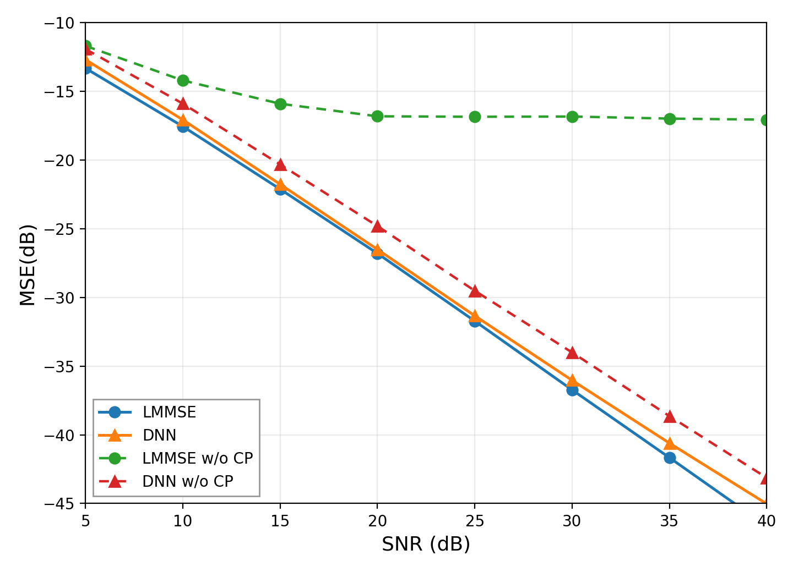

# Exercise 2.7: Data-Driven SISO-OFDM Channel Estimation

This project reproduces **Exercise 2.7** from the WCML book: channel estimation for a **SISO-OFDM** system using both

- **LMMSE**
- **DNN-based channel estimation**

under two settings:

- **with cyclic prefix (CP)** -> solid-line results
- **without cyclic prefix (w/o CP)** -> dashed-line results

The target is to reproduce the MSE-vs-SNR curves in **Figure 2.9** for SNR values from **5 dB to 40 dB** with a **5 dB step**.

---

## 1. Repository Contents

```text
.
├── main.py                  # Main entry point for training/testing across all SNRs
├── plot_figure.py           # Plot Figure 2.9 from saved .mat results
├── run_exercise_2_7.sh      # One-shot local runner for all six cases
├── dnn_ce/                  # Saved DNN checkpoints (.npz)
├── tools/
│   ├── networks.py          # DNN model definition and training logic
│   ├── raputil.py           # OFDM utilities, data generation, testing, LMMSE
│   ├── train.py             # Save/load helpers for TensorFlow variables
│   ├── channel_train.npy    # Channel dataset for training
│   └── channel_test.npy     # Channel dataset for evaluation
└── MSE_*.mat                # Saved MSE curves
```

---

## 2. Problem Setup

The scripts are configured for the following Exercise 2.7 setting:

## Visualization Results



---

## 1. Repository Contents

```text
.
├── main.py                  # Main entry point for training/testing across all SNRs
├── plot_figure.py           # Plot Figure 2.9 from saved .mat results
├── run_exercise_2_7.sh      # One-shot local runner for all six cases
├── dnn_ce/                  # Saved DNN checkpoints (.npz)
├── tools/
│   ├── networks.py          # DNN model definition and training logic
│   ├── raputil.py           # OFDM utilities, data generation, testing, LMMSE
│   ├── train.py             # Save/load helpers for TensorFlow variables
│   ├── channel_train.npy    # Channel dataset for training
│   └── channel_test.npy     # Channel dataset for evaluation
└── MSE_*.mat                # Saved MSE curves
```

---

## 2. Problem Setup

The scripts are configured for the following Exercise 2.7 setting:

>>>>>>> 0c68dab (update)
- **Number of subcarriers:** 64
- **Pilot OFDM symbol:** 64 QPSK pilot symbols
- **Data OFDM symbol:** 64-QAM
- **SNR sweep:** 5, 10, 15, 20, 25, 30, 35, 40 dB
- **Estimators:** DNN and LMMSE
- **Two scenarios:** with CP and without CP

The expected workflow is:

1. Train DNN with CP
2. Test DNN with CP
3. Test LMMSE with CP
4. Train DNN without CP
5. Test DNN without CP
6. Test LMMSE without CP
7. Plot the four curves together

---

## 3. Conda Environment Setup

A clean Conda environment is recommended.

### Minimal environment
```bash
conda create -n wcml python=3.10 -y
conda activate wcml

python -m pip install --upgrade pip
python -m pip install numpy scipy matplotlib
python -m pip install tensorflow
```

### Notes
- The code uses `tensorflow.compat.v1`, so it runs in TensorFlow v1-style graph mode even when installed from a TensorFlow 2.x package.
- If your machine or cluster requires a platform-specific TensorFlow installation procedure, keep the rest of the environment the same and adjust only the TensorFlow install step.

---

## 4. How `main.py` Works

`main.py` loops over all SNR points in:

```python
SNR_train = [5, 10, 15, 20, 25, 30, 35, 40]
```

Key configuration variables inside `main.py`:

- `training_epochs`
- `batch_size`
- `ce_type`  
  - `'dnn'`
  - `'mmse'`
- `test_ce`  
  - `False` = train DNN
  - `True` = evaluate and save MSE
- `CP_flag`  
  - `True` = with CP
  - `False` = w/o CP

Output checkpoint naming:

- with CP:
  - `dnn_ce/CE_DNN_64QAM_SNR_5dB.npz`
  - ...
- without CP:
  - `dnn_ce/CE_DNN_CPFREE_64QAM_SNR_5dB.npz`
  - ...

Output MSE files:

- `MSE_dnn_64QAM.mat`
- `MSE_mmse_64QAM.mat`
- `MSE_dnn_64QAM_CP_FREE.mat`
- `MSE_mmse_64QAM_CP_FREE.mat`

---

## 5. Recommended One-Command Run

The simplest way to run the full exercise locally is:

```bash
bash run_exercise_2_7.sh
```

This script will automatically execute all six stages:

1. DNN train with CP
2. DNN test with CP
3. LMMSE test with CP
4. DNN train without CP
5. DNN test without CP
6. LMMSE test without CP

and then call:

```bash
python plot_figure.py
```

to generate the final figure.

### Default behavior
The script uses these defaults unless overridden:

- `EPOCHS=2000`
- `BATCH_SIZE=50`
- `CLEAN=0`

### Example usage
Run with default settings:
```bash
bash run_exercise_2_7.sh
```

Run with custom epochs and batch size:
```bash
EPOCHS=600 BATCH_SIZE=128 bash run_exercise_2_7.sh
```

Force cleanup before rerunning:
```bash
CLEAN=1 bash run_exercise_2_7.sh
```

Use all overrides together:
```bash
CLEAN=1 EPOCHS=800 BATCH_SIZE=256 bash run_exercise_2_7.sh
```

### What `run_exercise_2_7.sh` actually does
The script:

- checks Python syntax first with `py_compile`
- makes a temporary backup of `main.py`
- patches `main.py` between runs to switch:
  - estimator type
  - train/test mode
  - CP on/off
  - epochs
  - batch size
- restores the original `main.py` automatically on exit

This means you can use the shell script without manually editing `main.py` for each stage.

---

## 6. Manual Run Method

If you prefer to control the workflow manually, edit `main.py` and run:

```bash
python main.py
```

for each case.

### A. DNN training with CP
Set:
```python
ce_type = 'dnn'
test_ce = False
CP_flag = True
```

Then run:
```bash
python main.py
```

### B. DNN testing with CP
Set:
```python
ce_type = 'dnn'
test_ce = True
CP_flag = True
```

Then run:
```bash
python main.py
```

### C. LMMSE testing with CP
Set:
```python
ce_type = 'mmse'
test_ce = True
CP_flag = True
```

Then run:
```bash
python main.py
```

### D. DNN training without CP
Set:
```python
ce_type = 'dnn'
test_ce = False
CP_flag = False
```

Then run:
```bash
python main.py
```

### E. DNN testing without CP
Set:
```python
ce_type = 'dnn'
test_ce = True
CP_flag = False
```

Then run:
```bash
python main.py
```

### F. LMMSE testing without CP
Set:
```python
ce_type = 'mmse'
test_ce = True
CP_flag = False
```

Then run:
```bash
python main.py
```

### G. Plot the reproduced figure
```bash
python plot_figure.py
```

---

## 7. Expected Outputs

After a successful full run, you should see:

### Checkpoints
```text
dnn_ce/CE_DNN_64QAM_SNR_5dB.npz
dnn_ce/CE_DNN_64QAM_SNR_10dB.npz
...
dnn_ce/CE_DNN_CPFREE_64QAM_SNR_40dB.npz
```

### MSE result files
```text
MSE_dnn_64QAM.mat
MSE_mmse_64QAM.mat
MSE_dnn_64QAM_CP_FREE.mat
MSE_mmse_64QAM_CP_FREE.mat
```

### Final plots
```text
Figure_2_9_reproduced.png
Figure_2_9_reproduced.pdf
```

---

## 8. Common Failure Modes

### 1. `Checkpoint not found`
Typical cause:
- You ran DNN test before DNN train finished.

Fix:
- train first, then test the same CP/No-CP setting.

### 2. TensorFlow cannot see the GPU
Typical cause:
- cluster or local CUDA/cuDNN/TensorFlow stack is not aligned.

Fix:
- keep the Python-side commands unchanged and resolve the TensorFlow installation for your machine first.

### 3. Plot exists but one curve is stale
Typical cause:
- `plot_figure.py` is reading old `MSE_*.mat` files.

Fix:
- remove old result files or rerun with `CLEAN=1`.

---

## 9. Reproducibility Notes

The code sets:

```python
np.random.seed(1)
tf.set_random_seed(1)
```

This improves reproducibility, but small numerical differences can still appear across:

- CPU vs GPU
- different TensorFlow builds
- different BLAS / driver stacks

What matters for this exercise is the overall curve trend and whether the reproduced figure matches the intended CP vs no-CP behavior.

---

## 10. Suggested Workflow

For the cleanest end-to-end run:

```bash
conda activate wcml
CLEAN=1 EPOCHS=800 BATCH_SIZE=128 bash run_exercise_2_7.sh
```

Then check:

1. all expected `.npz` checkpoints exist
2. all four `MSE_*.mat` files were updated
3. `Figure_2_9_reproduced.png` was regenerated

---

## 11. Reference

Original exercise source:
- <https://github.com/le-liang/wcmlbook/tree/main/ch2/Exercise_2.7>
